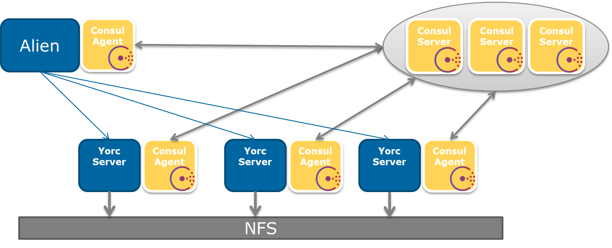

Run Yorc in High Availability (HA) mode
=======================================

High level view of a typical HA installation
--------------------------------------------

The bellow figure illustrates how a typical Yorc setup for enabling High Availability looks like.

This setup is composed by the following main components:

  * A POSIX distributed file system (NFS as an example in the figure above) to store deployments recipes (Shell scripts, Ansible recipes, binaries...)
  * A cluster of Consul servers
  * A cluster of Yorc servers each one collocated with a Consul agent and connected to the distributed filesystem
  * A Alien4Cloud with the Yorc plugin collocated with a Consul agent

The next sections describes how to setup those components.

Yorc HA setup
--------------

Distributed File System
~~~~~~~~~~~~~~~~~~~~~~~

Describing how to setup a Distributed File System (DSF) is out of the scope of this document.
When choosing your DSF please take care to verify that it is POSIX compatible and can be mounted as linux partition.

Consul servers
~~~~~~~~~~~~~~

To setup a cluster of Consul servers please refer to the `Consul online documentation <https://www.consul.io/docs/guides/bootstrapping.html>`_.
One important thing to note is that you will need 3 or 5 Consul servers to ensure HA.

Yorc servers
~~~~~~~~~~~~~

Each Yorc server should be installed on its own host with a local Consul agent and a partition mounted on the Distributed File System.
The Consul agent should run in client mode (by opposition to the server mode).
Here is how to run a Consul agent in client mode and connect it to a running Consul server cluster.

.. code-block:: bash

    consul agent -config-dir ./consul-conf -data-dir ./consul-data -retry-join <ConsulServer1IP> -retry-join <ConsulServer2IP> -retry-join <ConsulServer3IP>

When starting the Yorc server instance, a Consul service is automatically created with a defined TCP check on Yorc port.

When running Yorc you should use the :ref:`--server_id <option_server_id_cmd>` command line flag
(or equivalent configuration options or environment variable) to specify the server ID used to identify the server node in a cluster.

When running Yorc you should use the :ref:`--working_directory <option_workdir_cmd>` command line flag 
(or equivalent configuration options or environment variable) to specify a working directory on the 
Distributed File System.

Alien4Cloud
~~~~~~~~~~~

Please refer to the dedicated Yorc plugin for Alien4Cloud documentation for its typical installation and configuration.

Install and run Consul agent in client mode.

.. code-block:: bash

    consul agent -config-dir ./consul-conf -data-dir ./consul-data -retry-join <ConsulServer1IP> -retry-join <ConsulServer2IP> -retry-join <ConsulServer3IP> -recursor <ConsulServer1IP> -recursor <ConsulServer2IP> -recursor <ConsulServer3IP>

`Configure Consul DNS forwarding <https://www.consul.io/docs/guides/forwarding.html>`_ in order to be able to resolve ``yorc.service.consul`` DNS domain name.

In the Yorc plugin for Alien4Cloud configuration use ``http://yorc.service.consul:8800`` as Yorc URL instead of using a IP address.
This DNS name will be resolved by Consul (using a round-robin algorithm) to available Yorc servers.

If a Yorc server becomes unavailable, then Consul will detect it by using the service check and will stop to resolve the DNS requests to this Yorc instance, allowing seamless failover.

