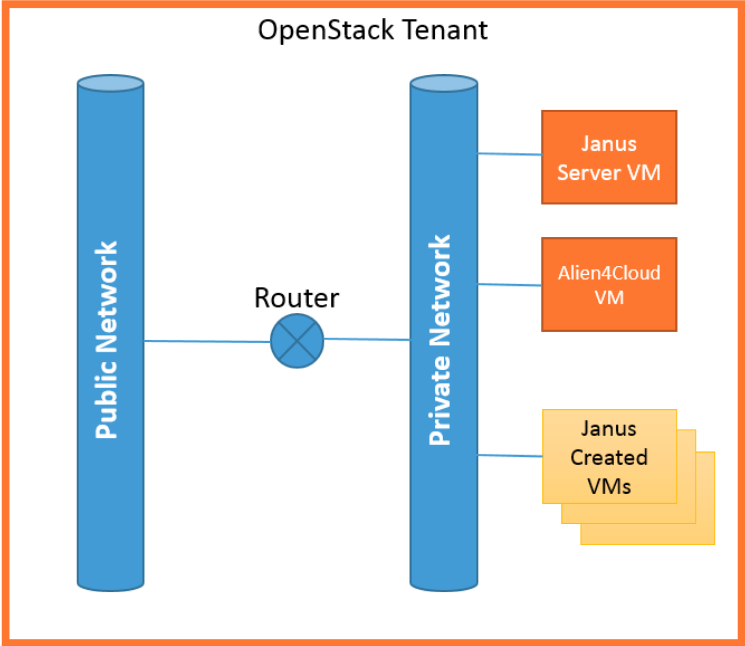

Install Janus and requirements
==============================

Typical Janus deployment for OpenStack
--------------------------------------

In order to provision softwares on virtual machines that do not necessary have a floating IP we recommend to install Janus itself on a virtual machine 
in your OpenStack tenant. Alien4Cloud and the Alien4Cloud Janus Plugin (see their dedicated documentation to know how to install them) may be collocated
on the same VM or resides in a different VM.

Virtual Machines created by Janus should be connected to the same private network as the Janus VM (the :ref:`--infrastructure_openstack_private_network_name <option_infra_os>`
configuration flag allows to do it automatically). In order to provision Floating IPs, this private network should be connected to the public network 
of the tenant through a router.

Host requirements
-----------------

Janus requires a Linux x86_64 system to operate with at least 2 CPU and 2 Go of RAM.

Packages installation
---------------------

Following packages are required to perform the installation:
  * python
  * python-pip
  * zip/unzip
  * openssh-client
  * wget 

Now you can proceed with the installation of softwares used by Janus.

.. parsed-literal::

    sudo pip install ansible==\ |ansible_version|
    wget \https://releases.hashicorp.com/consul/\ |consul_version|\ /consul\_\ |consul_version|\ _linux_amd64.zip
    sudo unzip consul\_\ |consul_version|\ _linux_amd64.zip -d /usr/local/bin
    wget \https://releases.hashicorp.com/terraform/\ |terraform_version|\ /terraform\_\ |terraform_version|\ _linux_amd64.zip
    sudo unzip terraform\_\ |terraform_version|\ _linux_amd64.zip -d /usr/local/bin

Finally you can install the Janus binary into ``/usr/local/bin``.

Final setup
-----------

In order to provision softwares through ssh, you need to store the ssh private key that will be used to connect to the nodes under 
``$HOME/.ssh/janus.pem`` where ``$HOME`` is the home directory of the user running Janus. This key should part of the authorized keys on remote hosts.
Generally, for OpenStack, it corresponds to the private key of the keypair used to create the instance. 

.. note:: A common issue is to create a key file that does not comply the ssh requirements for private keys (should be readable by the user but not
          accessible by group/others read/write/execute).

