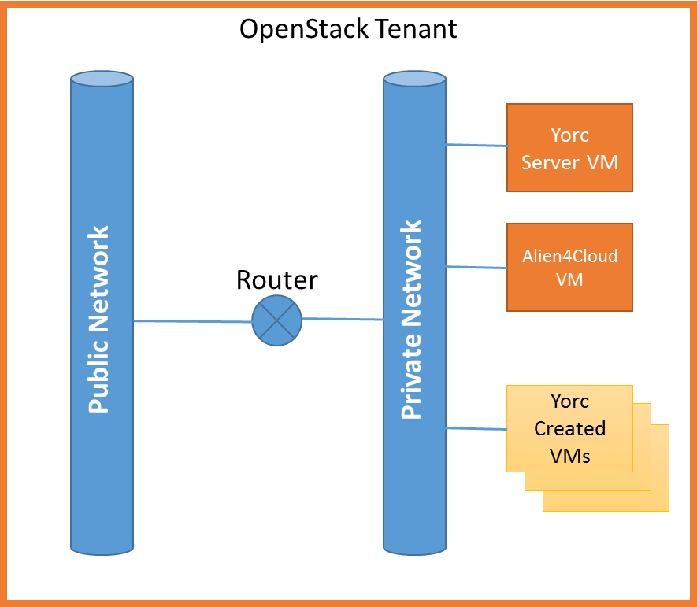

..
   Copyright 2018 Bull S.A.S. Atos Technologies - Bull, Rue Jean Jaures, B.P.68, 78340, Les Clayes-sous-Bois, France.

   Licensed under the Apache License, Version 2.0 (the "License");
   you may not use this file except in compliance with the License.
   You may obtain a copy of the License at

       http://www.apache.org/licenses/LICENSE-2.0

   Unless required by applicable law or agreed to in writing, software
   distributed under the License is distributed on an "AS IS" BASIS,
   WITHOUT WARRANTIES OR CONDITIONS OF ANY KIND, either express or implied.
   See the License for the specific language governing permissions and
   limitations under the License.
   ---

.. _yorc_install_section:

Install Yorc and requirements
==============================

This section describes how to install Yorc manually.
Different ways of installing Yorc are described in other sections:

  * :ref:`yorc_bootstrap_section` using ``yorc bootstrap`` CLI. This will allow you deploy Yorc, its dependencies, and the UI Alien4Cloud on a given infrastructure (Google Cloud, AWS, OpenStack or Hosts Pool)
  * :ref:`yorc_docker_section`.

Typical Yorc deployment for OpenStack
--------------------------------------

In order to provision softwares on virtual machines that do not necessary have a floating IP we recommend to install Yorc itself on a virtual machine 
in your OpenStack tenant. Alien4Cloud and the Alien4Cloud Yorc Plugin (see their dedicated documentation to know how to install them) may be collocated
on the same VM or resides in a different VM.

Virtual Machines created by Yorc should be connected to the same private network as the Yorc VM (the location property :ref:`private_network_name <option_infra_os>`
related to an openstack location type allows to do it automatically). In order to provision Floating IPs, this private network should be connected to the public network
of the tenant through a router.

Host requirements
-----------------

Yorc requires a Linux x86_64 system to operate with at least 2 CPU and 2 Go of RAM.

Packages installation
---------------------

Following packages are required to perform the installation:
  * python and python-pip
    (or python3/python3-pip. In addition, to have Ansible use python3 on remote hosts, see :ref:`Ansible Inventory Configuration section <option_ansible_inventory_cfg>`)
  * zip/unzip
  * openssh-client
  * wget 

Now you can proceed with the installation of softwares used by Yorc.

.. parsed-literal::

    sudo pip install ansible==\ |ansible_version|
    sudo pip install paramiko
    wget \https://releases.hashicorp.com/consul/\ |consul_version|\ /consul\_\ |consul_version|\ _linux_amd64.zip
    sudo unzip consul\_\ |consul_version|\ _linux_amd64.zip -d /usr/local/bin
    wget \https://releases.hashicorp.com/terraform/\ |terraform_version|\ /terraform\_\ |terraform_version|\ _linux_amd64.zip
    sudo unzip terraform\_\ |terraform_version|\ _linux_amd64.zip -d /usr/local/bin

As Terraform uses plugins for required providers, you can pre-installed them in a directory you specify with the Yorc Server
configuration option (:ref:`--terraform_plugins_dir <option_terraform_plugins_dir_cmd>`).
Here are the command lines for installing all providers in ``/var/terraform/plugins``.
See https://www.terraform.io/guides/running-terraform-in-automation.html#pre-installed-plugins for more information.

.. parsed-literal::
    sudo mkdir -p /var/terraform/plugins

    wget \https://releases.hashicorp.com/terraform-provider-consul/\ |tf_consul_plugin_version|\ /terraform-provider-consul\_\ |tf_consul_plugin_version|\ _linux_amd64.zip
    sudo unzip terraform-provider-consul\_\ |tf_consul_plugin_version|\ _linux_amd64.zip -d /var/terraform/plugins

    wget \https://releases.hashicorp.com/terraform-provider-null/1.0.0/terraform-provider-null_1.0.0_linux_amd64.zip
    sudo unzip terraform-provider-null_1.0.0_linux_amd64.zip -d /var/terraform/plugins

    wget \https://releases.hashicorp.com/terraform-provider-aws/\ |tf_aws_plugin_version|\ /terraform-provider-aws\_\ |tf_aws_plugin_version|\ _linux_amd64.zip
    sudo unzip terraform-provider-aws\_\ |tf_aws_plugin_version|\ _linux_amd64.zip -d /var/terraform/plugins

    wget \https://releases.hashicorp.com/terraform-provider-google/\ |tf_google_plugin_version|\ /terraform-provider-google\_\ |tf_google_plugin_version|\ _linux_amd64.zip
    sudo unzip terraform-provider-google\_\ |tf_google_plugin_version|\ _linux_amd64.zip -d /var/terraform/plugins

    wget \https://releases.hashicorp.com/terraform-provider-openstack/\ |tf_openstack_plugin_version|\ /terraform-provider-openstack\_\ |tf_openstack_plugin_version|\ _linux_amd64.zip
    sudo unzip terraform-provider-openstack\_\ |tf_openstack_plugin_version|\ _linux_amd64.zip -d /var/terraform/plugins

    sudo chmod 775 /var/terraform/plugins/*

Finally you can install the Yorc binary into ``/usr/local/bin``.

To support :ref:`Orchestrator-hosted operations <tosca_orchestrator_hosted_operations>` sandboxed into Docker containers the following
softwares should also be installed.

.. code-block:: bash

  # for apt based distributions
  sudo apt install Docker
  # for yum based distributions
  sudo yum install Docker
  # Docker should be running and configured to works with http proxies if any
  sudo systemctl enable docker
  sudo systemctl start docker
  
  sudo pip install docker-py

For a complete Ansible experience please install the following python libs:

.. code-block:: bash

  # To support json_query filter for jinja2
  sudo pip install jmespath
  # To works easily with CIDRs
  sudo pip install netaddr

To support Ansible SSH password authentication instead of common ssh keys, the sshpass helper program needs to be installed too.

.. code-block:: bash

  # for apt based distributions
  sudo apt install sshpass
  # for yum based distributions
  sudo yum install sshpass

Final setup
-----------

In order to provision softwares through ssh, you need to store the ssh private key that will be used to connect to the nodes under 
``$HOME/.ssh/yorc.pem`` where ``$HOME`` is the home directory of the user running Yorc. This key should part of the authorized keys on remote hosts.
Generally, for OpenStack, it corresponds to the private key of the keypair used to create the instance. 

.. note:: A common issue is to create a key file that does not comply the ssh requirements for private keys (should be readable by the user but not
          accessible by group/others read/write/execute).

